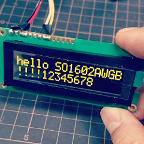
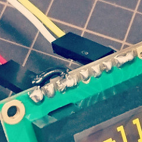
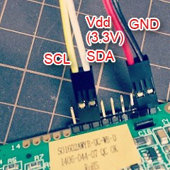

SO1602AW-test.ino
====
A simple library for SO1602AWWB, SO1602AWGB, SO1602AWYB.

OLED Character Display Module 16x2
- http://akizukidenshi.com/catalog/g/gP-08277/ (White)
- http://akizukidenshi.com/catalog/g/gP-08276/ (Green)
- http://akizukidenshi.com/catalog/g/gP-08278/ (Yellow)

How to use
----

    #include <Wire.h>
    
    void setup() {
      Wire.begin(5, 4); //SCL, SDA
      so1602awgb_init();
      so1602awgb_print("hello world");
    }
    void loop() {}

OLED Character Display Module Pin Assign
----

    1 GND
    2 Vdd (3.3V)
    3 C/S (short to GND)
    4 I2C Slave Address (L->0x3c, H->0x3d)
    5 NC
    6 NC
    7 SCL (I2C clock)
    8 SDA IN (I2C data)
    9 SDA OUT (I2Cdata)
    10～14 NC
       ※ short (1,3,4) and (8,9)...

Copyright and license
----

Copyright (c) 2016 yoggy

Released under the [MIT license](LICENSE.txt)